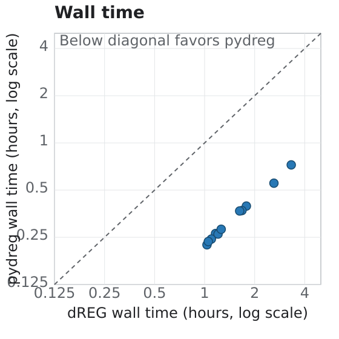
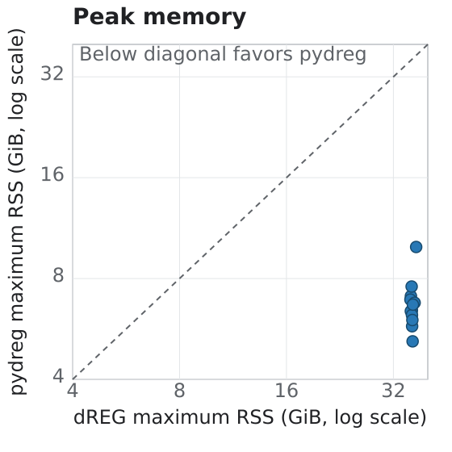

# Performance design choices

`pydreg`'s guiding rule for every performance change is that it must not
change the pipeline's output: same scores, same peaks, same
faithfully-replicated R quirks (see `docs/PLANNING.md`) — verified against
the existing test suite and, for the peak-calling changes below, directly
against real dREG output (~0.999 Jaccard index on test data; see
`docs/METHODS.md`). This document explains the resulting design choices at a
level meant for anyone using or extending `pydreg`, not just the people who
made them. The full chronological research log — every benchmark, every
dead end, every number — lives in `docs/PERF_LOG.md`; this document is the
distilled "why it's built this way" version.

## End-to-end performance

On an NVIDIA P100 using 16 cores, pydreg is consistently faster and uses
less peak memory than dREG across completed paired experiments:

  
  

## Scoring: four backends, why NumPy (not scikit-learn) is the CPU default, and why the GPU tiers are `cupy`/`mlx` (not `cuML`)

Evaluating the pretrained SVR (605,187 support vectors) against every
informative position is dominated by one computation: an RBF kernel matrix
between the query positions and every support vector. `pydreg` offers four
backends for this (`--backend {auto,cupy,mlx,sklearn,numpy}`):

- **NumPy** (default on any machine without a usable GPU): computes the
  kernel matrix as one chunked matrix multiplication
  (`X_scaled @ sv_block.T`), dispatching to whatever BLAS library NumPy is
  linked against.
- **scikit-learn**: wraps the same pretrained weights into an
  `sklearn.svm.SVR` (via `to_sklearn_svr()`) and predicts through libsvm.
- **cupy** (`pydreg[gpu]`, Linux + NVIDIA only, auto-selected whenever a
  usable CUDA device is present): the exact same chunked-matmul formula as
  the NumPy tier, run directly on a CuPy device array.
- **mlx** (`pydreg[mlx]`, macOS + Apple Silicon only, auto-selected
  whenever a usable Metal GPU is present and cupy isn't applicable): the
  same chunked-matmul formula again, this time on an MLX device array
  running on the machine's Metal GPU. See "Apple Silicon: the `mlx` tier"
  below.

scikit-learn is available (`--backend sklearn`) but is **never
auto-selected on CPU** — originally measured at ~14-15x slower than the
NumPy tier for this workload (despite computing identical math, both agree
to ~1e-10), and that gap has only grown since: libsvm's own prediction
path is unchanged, while the NumPy tier got substantially faster from the
numba-fusion work below (see "The CPU ('numpy') scoring backend"). Re-measured
on the same Apple M4 at a 4096-query batch (`scripts/bench_backends.py
--backends numpy sklearn --batch-sizes 4096`): sklearn now takes 269.3s
against the fused NumPy tier's 6.8s, **~39.6x** slower, not ~14-15x. The
underlying reason is a genuinely different computational shape, not a
tuning gap that closed or could close with more threads: libsvm's
prediction path evaluates the kernel one query-support-vector pair at a
time (with a heap allocation per pair), while `DREGModel.predict`'s
chunked matmul computes the entire kernel matrix in one BLAS call (and,
as of the fusion below, one fused numba kernel for the elementwise/reduce
step in between). Not fixable by parallelizing libsvm's loop, and there's
no reason to expect Intel's oneDAL-accelerated scikit-learn fork
(`scikit-learn-intelex`) to help either, beyond the fact that it doesn't
ship any macOS/ARM wheels at all and would need real engineering to even
engage on a model that was never `.fit()` through it (see
`docs/PERF_LOG.md` for the full investigation of both).

### Why `cupy`, not `cuML`

The GPU tier used to be `cuml.svm.SVR` (built via `from_sklearn()`), not
`cupy`. It was dropped after real-hardware testing found a serious, confirmed
problem: RAPIDS/cuML dropped support for Pascal GPUs (compute capability
< 7.0) in its 24.02 release, and running a Pascal-incompatible cuML build on
such a GPU doesn't raise an error — per RAPIDS's own deprecation notice, it
"will either fail or return invalid results." Confirmed end-to-end on real
production data: cuml 26.06.00's `SVR.from_sklearn()`-built model diverged
from the NumPy reference by ~0.05 on an NVIDIA TITAN X (Pascal, compute
capability 6.1), while the *exact same bigWig inputs*, run on an A100
(compute capability 8.0), produced no divergence (Jaccard > 0.999 vs. real
dREG). `from_sklearn` itself only shipped in cuML 25.02, a full year after
Pascal support was dropped in 24.02 — there was no cuML release that
supported both, so pinning an older cuML was never a workaround. Pascal's
own crippled double-precision throughput (this SVR is inherently float64,
and cuML offered no float32 override — see below) made GPU acceleration a
poor fit there even setting compatibility aside.

`pydreg.backend._build_cupy_predict_fn` sidesteps all of this by not routing
through `cuml.svm` (or any third-party SVM library) at all — it's a
near-verbatim port of `DREGModel.predict`'s chunked RBF dual-sum formula
(same expanded squared-distance trick, same chunking over support vectors),
just evaluated on a CuPy device array instead of a NumPy host array. Two
things follow directly from that being *the same formula* rather than a
separate implementation:

- **No cross-library conversion risk.** The old cuml tier (and the
  still-present sklearn tier) depend on `to_sklearn_svr()`'s
  private-attribute round trip and then on an independent kernel-evaluation
  codebase (cuML's or libsvm's own C++) agreeing with `DREGModel.predict` —
  exactly the class of bug the Pascal investigation chased down. The cupy
  tier has nothing to independently agree with; it *is* the reference
  formula, just relocated to the GPU.
- **It isn't limited to compute capability ≥7.0.** CuPy's own array
  primitives (elementwise ops, matmul via cuBLAS) support compute
  capability ≥3.0 — RAPIDS/cuML's Pascal drop was a policy decision about
  its own compiled kernels, not a CUDA-wide one. Confirmed correct on the
  exact TITAN X that broke the cuml tier, and now faster than cuml ever was
  there (and on an A100) after this session's fusion/batching/float32 work
  (see below).

Getting the old cuml tier to float32 (to close the speed gap a different
way) was investigated and found infeasible to do safely: `cuml.svm.SVR.
from_sklearn()` hardcoded `dtype=float64` with no override, and a
workaround would have meant bypassing it to manually replicate its private
attribute-setting logic — risky, version-fragile, and unverifiable without
real GPU hardware. `cupy` doesn't have this problem since it's pydreg's own
code with full control over every array's dtype.

`pydreg.backend.detect_backend()` now picks `cupy` whenever `_cuda_runtime_
available()` finds a usable CUDA device — no compute-capability gate is
needed, since `cupy` has no floor to speak of. `_wrap_sklearn_like`'s
first-batch smoke test (comparing the first batch's predictions against the
NumPy reference) remains in place regardless, as the last line of defense
against *any* backend conversion issue, hardware-related or not — it's what
caught the real cuml divergence above, and a real bug in `cupy`'s own
fusion code during this tier's development (see below).

### Installing `cupy` needs `[ctk]`, not just `cupy-cuda12x` alone

Real hardware hit `cupy is installed but could not build a GPU predict
function: ... catastrophic error: #error directive: "CUDA versions below 12
are not supported."` on a machine with an NVIDIA driver reporting CUDA
13.0 support but no separately-installed CUDA toolkit (`nvcc`) at all.
Confusing, because the driver was more than new enough — but `nvidia-smi`'s
"CUDA Version" field reports what the *driver* supports, not what CUDA
toolkit is actually available for CuPy to JIT-compile kernels with at
runtime, and those turned out to be two different things here.

Root cause, found in `cupy-cuda12x`'s own PyPI dependency metadata: as of
CuPy 14.x, the base package no longer unconditionally bundles its own CUDA
toolkit (nvrtc/cudart/cublas/...) — it uses a new `cuda-pathfinder`
dependency to *locate* one, either system-installed or via CuPy's own
optional `[ctk]` extra. On a machine with only a driver and no
separately-installed toolkit, `cuda-pathfinder` has nothing to find, and
CuPy fails at JIT-compile time with this exact confusing error. This
regressed specifically *because* the old `cuml` tier was dropped: `cuml-
cu12` transitively pulled in a full pip-installed CUDA 12.x runtime
(`nvidia-cuda-nvrtc-cu12`, `nvidia-cuda-runtime-cu12`, `nvidia-cublas-cu12`,
etc. — visible as exactly the packages that disappeared from `uv.lock`
when `cuml-cu12` was removed), which `cupy` was silently finding and using
the whole time it was installed alongside it. Removing `cuml` removed that
accidental safety net.

**Fix**: `pyproject.toml`'s `gpu` extra now requests `cupy-cuda12x[ctk]`,
not bare `cupy-cuda12x` — confirmed via `uv lock` that this pulls the full
CUDA 12.x toolkit (`nvidia-cuda-nvrtc-cu12`, `cuda-toolkit`, etc.) back in
as real pip dependencies, the same self-contained runtime `cuml-cu12` used
to provide as a side effect. Doesn't depend on anything being installed
system-wide.

### Speeding it up: kernel fusion, then batch size

Two independent levers, in the order they're worth pulling:

1. **Fuse the elementwise glue between the two GEMMs.** The two matmuls
   (`X @ SV.T` and `K @ coefs`) are already cuBLAS calls — near-optimal
   without touching precision. The formula between them
   (`exp(-gamma * (sq_x + sq_sv - 2*cross))`) was originally ~5 separate
   elementwise kernel launches, each reading/writing a full
   `(query_chunk, sv_chunk)` array to GPU global memory — pure
   memory-bandwidth overhead on what's fundamentally a memory-bound step
   (same reason the NumPy tier itself is memory-bandwidth-bound, not
   compute-bound). Fusing that whole chain into one kernel that reads its
   inputs once and writes `K` once cuts that traffic roughly 5x — same
   formula, same precision, just far less memory round-tripping.
   `cupy.fuse()` was tried first and produced a real, confirmed ~3.5e-4
   divergence on actual GPU hardware (caught by `_wrap_sklearn_like`'s own
   smoke test — a bug of this tier's own making, not cuML's, but caught by
   the exact same mechanism). Switched to `cupy.ElementwiseKernel` instead
   — CuPy's older, more battle-tested mechanism for this pattern, with
   every argument's dtype declared explicitly and no shape-based
   tracing/caching to get wrong; see `docs/PERF_LOG.md`'s 2026-07-15 entry
   for the full root-cause investigation. It also drops one live
   `(query_chunk, sv_chunk)`-shaped buffer entirely (the old separate
   `sqdist` intermediate no longer exists), which is why `sv_chunk`'s
   default could grow without exceeding the pre-fusion tier's peak memory.
2. **Batch size** (`--query-chunk` for the outer per-call size,
   `--cupy-sv-chunk`/`build_scorer`'s `cupy_sv_chunk` for the inner
   per-support-vector-chunk size inside `_build_cupy_predict_fn`). Unlike
   the old cuml tier (which tiled the kernel matrix internally in C++
   without ever materializing the whole thing), this tier's own Python
   code materializes
   the `(query_chunk, sv_chunk)` intermediate directly — so for a *fixed*
   GPU memory budget `B`, the total number of kernel-launch iterations is
   `total_queries * n_sv * 8 bytes / B`, independent of how `B` is split
   between the two chunk sizes. The original design reasoning (when this
   was still an unvalidated guess) was that growing `B` would reduce
   iteration count and better amortize per-launch overhead — **real
   hardware said otherwise.**

   **Confirmed on a real TITAN Xp and a real A100: batch size has no
   measurable effect on `predict()` throughput in either direction, on
   either card.** A full `--cupy-sv-chunk` sweep on the TITAN Xp
   (5,617,218 real positions, Jurkat PRO-seq) left `scorer.predict()`'s
   own time essentially flat across a 16x range:

   | `sv_chunk` | `predict()` time | max VRAM |
   |---|---|---|
   | 4,096 | 430.73s | ~1844 MB |
   | 8,192 | 440.60s | ~1844 MB |
   | 16,384 (current default) | not separately timed -- within the same flat range | ~1844 MB |
   | 32,768 (old default) | 435.10s | 3379 MB |
   | 65,536 | 435.36s | (not remeasured) |

   `--query-chunk` doubled to 8192 (at the default `sv_chunk`) showed the
   same flat result. The ~2.3% spread across the whole sweep is
   indistinguishable from ordinary run-to-run noise. On a real A100, a
   sweep from 4,096 all the way to 1,048,576 (i.e. one single chunk
   covering all 605,187 support vectors — no sv-chunking loop at all)
   showed no appreciable throughput change either, *and* GPU volatile
   utilization never saturated even at that extreme — a genuinely
   different, faster card confirming the same conclusion, not just
   reproducing the TITAN Xp's specific numbers. Likely explanation: this
   step is described above as "pure memory-bandwidth overhead," and that
   turns out to be the *whole* story at these chunk sizes, not just the
   dominant part — per-kernel-launch dispatch overhead was apparently
   never a meaningful fraction of the cost to begin with, so there's
   nothing for a bigger batch to amortize, and nothing lost by a smaller
   one either. (The A100's un-saturated utilization suggests the real
   bottleneck there is now something *outside* this chunking loop
   entirely — e.g. CPU-side feature extraction becoming proportionally
   larger as `predict()` itself gets faster, matching the trend already
   flagged in the extract-vs-predict table below; not yet root-caused.)

   Real per-GPU memory headroom wasn't known when the old 32,768 default
   was chosen (hence this knob being left tunable rather than hardcoded)
   — it's now known: **1844 MB is allocated before any chunked kernel
   launches even run at all** on the TITAN Xp (SV matrix + CUDA
   context/cuBLAS-handle overhead — more than double the ~836 MiB
   formula estimate for just the SV matrix), and that floor is exactly
   what `sv_chunk` values from 4,096 up through the new 16,384 default
   measure as their *total*, since their own transient contribution is
   small enough to disappear into it. **Shipped**:
   `_build_cupy_predict_fn`'s default `sv_chunk` lowered from 32,768 to
   **16,384** — the largest value that still sits at this VRAM floor
   (cutting usage ~45%, 3379 MB → ~1844 MB, on the TITAN Xp) while
   using half as many sv-chunking iterations as 8,192 would, with zero
   throughput cost confirmed on both cards tested. The `mlx` tier's own
   `sv_chunk` default is untouched — this investigation only covers
   discrete-NVIDIA-GPU memory behavior via CuPy, not Apple Silicon's
   unified-memory model. See `docs/PERF_LOG.md`'s 2026-08-20 entries for
   the full investigation and real numbers.

A further lever, since implemented: **float32 instead of float64** for the
two GEMMs and the fused RBF kernel (`y_scaled` still accumulates in
float64, cheap insurance against cross-chunk summation error). This
changes actual arithmetic precision rather than just scheduling, so it
needed its own justification, not just "the smoke test tolerance is
generous" — see below. It matters most on exactly the hardware that
motivated this whole tier: consumer Pascal GPUs (e.g. the TITAN X) have
crippled float64 throughput (~1:32 vs float32), so this is a large win
there specifically, separate from and additive to the fusion/batching
levers above.

That said, the risk here is smaller than "changes arithmetic precision"
usually implies, once you know where these model weights actually came
from. The current pretrained dREG models are trained via **Rgtsvm**
(dREG's GPU-accelerated SVM tool; `e1071` now exists purely as an
S3-compatibility layer around it, not as the thing that actually fits the
model). Traced Rgtsvm/GTSVM's actual C++/CUDA source
(`github.com/Danko-Lab/Rgtsvm`) to check for exactly this: does it use
float32 internally despite R passing `double`s across the API boundary?
It does, unconditionally, with no build-time opt-out ever exercised:

- `gtsvmpredict_epsregression_C` (`Rgtsvm.cpp:398-401`) narrows
  `gamma`/`coef0`/`degree`/`cost` straight from `double*` to a local
  `float`, with no double-precision code path at all for these.
- The support-vector matrix itself is stored internally as
  `SparseVector = std::vector<std::pair<unsigned int, float>>`
  (`svm.hpp:280`) — `InitializeDense`/`InitializeSparse` convert the
  incoming `GTSVM_TYPE_DOUBLE`-tagged R data down into this float-based
  representation on the way in; the `DOUBLE` tag just describes the input
  buffer's element type for reading purposes.
- The SVM optimizer's own internal type, `CUDA_FLOAT_DOUBLE`
  (`cuda_helpers.hpp:40-44`), is `float` unless the `CUDA_USE_DOUBLE`
  macro is defined at compile time — checked `configure.ac` end-to-end
  and that macro is never defined anywhere in the actual build.

So the alphas/support-vectors/rho this project exports to safetensors as
float64 were themselves *produced* by a training process with no
double-precision arithmetic anywhere internally — their real accuracy
ceiling was already float32, before pydreg's float64 storage ever enters
the picture. Running cupy-tier **inference** at float32 wouldn't trade away
precision the model actually has; there isn't more precision there to
trade away. If anything it would move pydreg's GPU behavior *closer* to
how real GPU-accelerated dREG behaved historically, not further from it.

This doesn't extend to the CPU tiers, though, and shouldn't be read as "so
just make everything float32." Checked libsvm's actual source too
(`cjlin1/libsvm`, what both `e1071` and `sklearn.svm.SVR` bind to for CPU
prediction): `svm_node.value` is `double`, `Kernel::k_function` and
`svm_predict_values` operate in `double` throughout. `Qfloat` (`typedef
float`) exists in libsvm but only for the *training*-time kernel cache
(`Cache`/`SVC_Q`/`SVR_Q`) — never in the predict path. So dREG's CPU
inference mode (`e1071`) has always been genuinely double-precision, and
pydreg's own NumPy/scikit-learn tiers already match that exactly. Down
casting those to float32 would be a real fidelity regression relative to
the actual historical CPU reference, for a speed motivation (crippled FP64
throughput) that's GPU-specific and doesn't apply to CPUs at all — not
recommended.

**Confirmed on real hardware, and the smoke test's tolerance adjusted
accordingly.** The float32 switch tripped `_wrap_sklearn_like`'s own
smoke test: real `max_abs_diff` values from ~2.3e-4 to ~5.4e-4 against the
float64 NumPy reference, with sklearn (CPU libsvm) independently agreeing
with that same reference to ~6e-11 on the same sample — the same cross-check pattern
from the original Pascal investigation, this time confirming the
divergence is cupy's own (expected) float32 arithmetic, not a conversion
bug. Root cause: the expanded-form squared-distance formula
(`sq_x + sq_sv - 2*cross`) is a classic catastrophic-cancellation setup for
nearby feature vectors, and while that's negligible in float64 (~15-16
significant digits to lose a few of), it consumes a much larger fraction
of float32's ~7 significant digits. The error is already baked into
`cross`'s value by the time it comes back from the float32 GEMM — doing
the subsequent subtract/exp step at higher precision doesn't recover it,
so this isn't cheaply fixable without a fundamentally different
mixed-precision GEMM technique. `_wrap_sklearn_like` now takes an
`atol`/`rtol` override, and `build_scorer()` passes a `CUPY_SMOKE_TEST_ATOL
= 1e-3` for the `cupy` tier specifically (`sklearn` keeps the default
`1e-4`, since it's genuinely float64) — loosened deliberately, with a real
measured number plus margin behind it, not a blanket weakening of the
safety net.

**Why this wasn't done for the old cuml tier.** `cuml.svm.SVR.from_sklearn()`
took no dtype parameter (`cuml/internals/base.pyx`'s `from_sklearn(cls,
model)` signature had none, and `SVMBase.__init__` didn't expose `dtype`
as a constructor option either — it was only ever set internally during
`.fit()`/`cpu_to_gpu()`, hardcoded to `np.float64` when converting from a
CPU model). Getting a genuinely float32 cuML SVR would have meant bypassing
`from_sklearn()` and manually setting `dtype`/`support_vectors_`/
`dual_coef_`/etc. directly, replicating cuML's own private
`_attrs_from_cpu` logic. That's a specific, real risk, not just "more
private-API surface": `_get_svm_model()` picked its C++ template
(`SvmModel<float>` vs `SvmModel<double>`) from the `dtype` flag, then
raw-pointer-reinterpreted the underlying array's memory accordingly. If
that flag and the array's actual dtype ever disagreed, it wouldn't
silently lose precision — it would read the wrong bytes entirely (garbage
or a crash), with no GPU available here to catch it. This risk (on top of
the Pascal incompatibility) is a big part of why `cuml` was dropped
entirely rather than kept around as a float32-patched second GPU tier.

### Apple Silicon: the `mlx` tier

`pydreg.backend._build_mlx_predict_fn` is the Apple Silicon counterpart to
`_build_cupy_predict_fn` above — the same near-verbatim port of
`DREGModel.predict`'s chunked RBF dual-sum formula, run on an
[MLX](https://github.com/ml-explore/mlx) device array (Apple's own array
framework, targeting the machine's Metal GPU) instead of a CuPy one. Same
motivation as `cupy`: it's the *same formula*, not a routed-through
third-party SVM library, so there's no independent kernel-evaluation
codebase that could silently disagree with the NumPy reference — just a
different array backend for identical math. Developed and validated
end-to-end on real Apple M4 hardware.

**float32 isn't a choice here — it's the only option.** Metal has no
float64 support at all: a plain float64 matmul on an MLX GPU array raises
`ValueError: float64 is not supported on the GPU`, confirmed directly on
real hardware. This differs from `cupy`, where float32 was a deliberate
speed tradeoff justified by tracing Rgtsvm's own training precision back to
its float32 ceiling (see above) — for `mlx`, double precision was never on
the table to begin with. One consequence: unlike `cupy`'s `y_scaled` (a
float64 array accumulated entirely on-device), MLX has nowhere on-device to
hold a float64 accumulator, so `_build_mlx_predict_fn` pulls each chunk's
small `(query_chunk,)`-sized result back to a host NumPy float64 array and
accumulates there instead — a cheap transfer (one short vector per
iteration, not the full `(query_chunk, sv_chunk)` kernel matrix), giving
the same cross-chunk summation insurance `cupy`'s on-device accumulator
does, just on the host.

**Fusion needed no fallback.** The elementwise glue between the two GEMMs
is wrapped in `mx.compile`, MLX's own supported graph-fusion mechanism —
the direct counterpart to `cupy.ElementwiseKernel` above. Unlike the cupy
tier, which had to abandon its first attempt (`cp.fuse()`) after it produced
a real divergence on actual hardware, `mx.compile` handled this function's
actual call pattern correctly the first time, including the exact
shape-mismatch case that broke `cp.fuse()` (`n_sv=605,187` isn't divisible
by `sv_chunk`, so the last chunk is a smaller, different shape than the
rest) — confirmed on real M4 hardware, not just assumed. So there was no
need to drop down to a hand-written custom Metal kernel
(`mx.fast.metal_kernel`) the way the cupy tier dropped from `cp.fuse()` to
`ElementwiseKernel`. `gamma` is still closed over as a plain Python float
rather than passed as a traced `mx.compile` argument, matching
`ElementwiseKernel`'s literal-gamma approach for the same reason (avoiding
any dtype-promotion ambiguity between a Python scalar and the float32
arrays it multiplies) — and since Metal has no float64 path to silently
fall back into, a clean float32 result here is itself confirmation the
promotion behaved as intended, not just a hope.

**Confirmed on real hardware, against the real pretrained model** (605,187
SVs x 360 features): max-abs-diff against the NumPy float64 reference was
~1.1e-4 on a small batch and ~3.4e-4 at a 4096-query batch — comfortably
inside `MLX_SMOKE_TEST_ATOL` (`1e-3`, reusing `CUPY_SMOKE_TEST_ATOL`'s
value, since both tiers hit the identical float32 catastrophic-cancellation
limitation in the identical expanded-form squared-distance formula — see
above), and the same order of magnitude as `cupy`'s own measured
2.3e-4–5.4e-4 range on real NVIDIA hardware. Speed: **~6.1x** faster than
the NumPy tier at that same 4096-query batch size on an Apple M4 (1.16s
vs 7.06s per call, warm/post-compile, re-measured via `scripts/
bench_backends.py` after the NumPy tier's own numba-fusion speedup below
— originally ~19x, back when the NumPy tier's elementwise RBF step ran
single-threaded; `mlx` itself hasn't changed). See `docs/PERF_LOG.md`'s 2026-08-10
entry for the full numbers.

Not yet investigated: real `--mlx-sv-chunk` memory-headroom tuning. MLX's
unified memory means its actual constraint (shared with the whole OS, not a
dedicated VRAM pool the way a discrete NVIDIA GPU has) is a different shape
than `cupy`'s, so the sv_chunk tuning guidance in "Speeding it up" above
doesn't necessarily transfer as-is — worth its own investigation if this
tier's real-world memory behavior ever becomes a practical concern.

## Batching

Each backend gets its own default query-chunk size
(`pydreg.backend.DEFAULT_QUERY_CHUNK`, overridable via `--query-chunk`),
sized for that backend's actual bottleneck:

- **NumPy**: bounded so the transient `(query_chunk, sv_chunk)`-shaped
  intermediate arrays stay a manageable size in memory — this tier is
  memory-bandwidth-bound, not compute-bound.
- **scikit-learn**: libsvm's predict loop isn't memory-bound the same way,
  so its chunk size is mainly for streaming/checkpointing, not correctness.
- **cupy**: this tier's own Python code materializes the
  `(query_chunk, sv_chunk)` kernel-matrix intermediate directly, the same
  as the NumPy tier does on the CPU (unlike the old cuml tier, which tiled
  the kernel matrix internally in C++ without ever materializing the whole
  thing) — so it reuses NumPy's conservative default. Unvalidated on
  real GPU memory; likely worth tuning up once tested on real hardware.
- **mlx**: same shape as `cupy` (materializes the `(query_chunk, sv_chunk)`
  intermediate directly), so it reuses the same default too. Real headroom
  is unswept here as well — see "Apple Silicon: the `mlx` tier" above for
  why `cupy`'s tuning numbers don't necessarily transfer given MLX's
  unified-memory model.

## Overlapping feature extraction with scoring

`pipeline._score_positions` (used by every backend, not just GPU ones)
alternates two very different kinds of work per chunk: CPU-bound feature
extraction (bigWig I/O + multi-scale binning, see `pydreg.features`) and
the backend's own `scorer.predict()` call. These used to run strictly
sequentially — extract, then predict, then extract the next chunk, and so
on — which is invisible when the GPU kernel itself is the bottleneck, but
becomes a real cost once it isn't: real-hardware testing on a TITAN X
showed GPU utilization cycling 0–90% between chunks once the `cupy` tier's
float32 downcast (see below) cut its own compute time by an order of
magnitude — the GPU sitting idle while the CPU extracts the next chunk's
features, a cost that was always there but had been hidden behind a much
slower GPU kernel until that point (the same effect showed up on an A100
running `cuml`, independent of the float32 work — this bottleneck is
backend-agnostic).

`_score_positions` now runs a one-chunk-ahead prefetch: while the current
chunk's `scorer.predict()` blocks on the GPU, a single background thread
extracts the *next* chunk's features concurrently. This overlaps the two
steps instead of eliminating either one — same calls, same inputs, same
order, purely a scheduling change. It's safe specifically because exactly
one thread ever touches the bigWig readers at a time: the main thread
never reads a bigWig while a background extraction is in flight, and a
`ThreadPoolExecutor(max_workers=1)` guarantees only one extraction call is
ever in progress regardless of how far ahead a chunk gets submitted. The
overlap itself depends on `scorer.predict()` releasing the GIL while
blocked on the GPU (true of CuPy's device-sync calls) — on the
NumPy/scikit-learn CPU backends this can't hurt correctness, it just may
not overlap as usefully since there's no GPU wait to hide behind.

### Real measurements, and why extraction parallelism isn't implemented (yet)

`_score_positions` logs accumulated `extract_seconds`/`predict_seconds`
once per call (see its docstring), and real runs on both a TITAN Xp and an
A100 confirmed the prefetch is working, with a clear pattern across the
three call sites:

| step | TITAN Xp (extract / predict) | A100 (extract / predict) |
|---|---|---|
| informative positions (bulk scan) | 196.90s / 733.57s | 193.81s / 338.67s |
| gap-filled positions | 69.33s / 14.46s (reversed) | 58.15s / 6.65s (reversed) |
| 10bp-densified positions | 154.40s / 534.75s | 153.29s / 245.90s |
| **aggregate ratio (predict:extract)** | **3.05x** | **1.46x** |

Two of the three steps are predict-dominated (extraction mostly hides
behind the GPU wait, as intended) on both cards. The gap-filled-positions
step is a real, isolated exception — extraction dominates there, plausibly
because gap-filled points are scattered into sparse gaps by construction
(`peaks.find_gap_infp`), which likely defeats `_extract_features_cluster`'s
shared-fetch batching (clustering pays off for nearby points, not isolated
ones). It's a small absolute contributor either way (~5-10% of total
scoring time on these runs).

The more interesting signal is the *aggregate ratio dropping from 3.05x to
1.46x* between the two cards — extraction time is essentially unchanged
(CPU-bound, GPU-independent), while predict time shrank substantially on
the faster card, so the same fixed CPU cost is a growing fraction of the
total. Extrapolate that trend (a faster GPU still, or `cupy`+float32
becoming the default path on every card) and extraction could eventually
stop being fully hideable. Estimated full-fix upside on the numbers
above: only ~6-10% more wall time saved, since two of three steps are
already well-overlapped — not enough on its own to justify the change
today, but the trend is worth tracking.

**Investigated whether extraction could be safely parallelized across
multiple background workers, in case that trend continues.** Read
pybigtools' actual Rust source (`jackh726/bigtools`,
`pybigtools/src/reader.rs`): its `BBIReader.values()`/`.intervals()`/
`.zoom_intervals()` all take `&mut self`, and since `BBIReader` isn't
marked `unsendable` in its `#[pyclass]` attribute, PyO3 wraps it with a
runtime borrow-check cell enforcing Rust's aliasing rules independent of
the GIL — concurrently calling a read method from two threads on the
*same* `BBIReader` object raises `PyBorrowMutError` (a safe, loud failure,
not silent corruption, but still not usable concurrently). The underlying
reader types are generic over `CachedBBIFileRead<ReopenableFile>`,
though — built specifically around a `Reopen` trait meant for independent
handles onto the same file. So the safe pattern is **one
independently-opened `BBIReader` per worker thread** rather than sharing
`pipeline.run()`'s single `bw_plus`/`bw_minus` pair across threads.

**Update: implemented once real numbers justified it, then found a real
memory cost and moved to a dev branch instead of shipping it.** See
"Density-aware clustering: a free win kept; multi-threaded extraction:
tried, found a real memory cost, moved to a dev branch" below —
extraction in this release stays single-threaded, one reader, matching
this section's original scoping; the multi-reader variant sketched above
lives on the `multithreaded-extraction-dev` branch instead.

**Update:** the gap-filled-positions row above — extraction-dominant on
*both* cards, not just a fast one — is exactly the case a numba-jitted
`features._binned_sums_batch` targets directly. That function turned out
to be 60-80%+ of `_extract_features_cluster`'s own time at realistic
informative-position densities, and a fused (single-pass, no gather-index
arrays) numba kernel is a measured, bit-identical 2-4x faster than the
prior NumPy fancy-indexing version — see `docs/PERF_LOG.md`'s 2026-08-10
entry for the full investigation (including an initial, corrected
assumption that this only mattered on very fast GPUs). Real before/after
numbers on this table specifically (TITAN Xp/A100) haven't been re-run yet
— the entry above predates this change. `_binned_sums_batch_numba` was
later parallelized across positions too (`numba.prange`, embarrassingly
parallel, no cross-position reduction) for another ~3-4x on top of the
sequential jit, still bit-identical — see docs/PERF_LOG.md.

## Informative-position scanning: NumPy's per-call overhead, not the bigWig I/O, was the bottleneck

`infp.get_informative_positions` scans each chromosome for candidate
positions passing an OR/AND read-depth filter (see `docs/METHODS.md` for
what this step is for). A profile on a realistic 2-chromosome synthetic
bigWig (chr21/chr22-sized, ~837K informative positions found) turned up
two Python-side steps costing *more* combined than the actual bigWig I/O
they were built around:

- **`np.unique(np.concatenate(centers))`** (deduplicating candidate
  positions found across 9 phases, which overlap heavily) was 28% of total
  time — replaced with a chromosome-sized boolean mask
  (`mask[centers] = True; np.nonzero(mask)`), which gives the exact same
  sorted+deduplicated result without a comparison sort (every candidate is
  already bounded to `[0, chrom_size)` by construction). ~3x faster on
  this step.
- **`_windowed_sums_from_fine`'s `reshape(...).sum(axis=1)`** was 35% of
  total time — replaced with a numba kernel. NumPy's generic
  N-dimensional reduction carries real fixed per-row overhead that
  dominates when each reduction is very short, and dREG's own most common
  case (the OR-window/step ratio) sums only 2 elements per output bin —
  measured **11x faster** in numba for that ratio specifically (a smaller
  ~2x for the AND-window's wider ratio).

Combined: **305ms → 146ms (~2.1x)** warm wall-clock time for the same
synthetic scan on this session's hardware. See `docs/PERF_LOG.md`'s
2026-08-10 entry for the full profile breakdown and both fixes' individual
numbers.

## One `--cores` knob, not several: peak calling's worker processes and numba's thread count

`pipeline.run`'s `cores` parameter (`--cores`/`-p` on the CLI) is applied
consistently across every parallel stage in the pipeline, rather than
being a peak-calling-specific setting: `numba.set_num_threads(cores)` is
called once, early, governing the thread count for the numba-parallelized
feature-extraction/informative-position-scanning/scoring kernels
(`features._binned_sums_batch_numba`, `infp._windowed_sums_numba`,
`models._rbf_accumulate`), and the same value is threaded through to
`peaks.call_peaks`'s `ProcessPoolExecutor(max_workers=cores)` for the
final peak-calling stage. `threadpoolctl.threadpool_limits(limits=cores)`
is called right alongside `numba.set_num_threads(cores)` for the same
reason: BLAS otherwise never learns about `cores` at all and defaults to
auto-detecting the whole machine's core count regardless of what was
requested — confirmed harmless on machines with no threadpoolctl-visible
BLAS (`threadpool_limits()` is a documented no-op there). Deliberately one
number, not several independently-tunable ones — a pipeline that
restricted peak calling to, say, 4 processes while numba's kernels or BLAS
defaulted to using every detected core elsewhere would both undersell
available hardware in one stage and oversubscribe it in another, depending
on which stage you happened to be looking at.

## Density-aware clustering: a free win kept; multi-threaded extraction: tried, found a real memory cost, moved to a dev branch

Real production runs (TITAN Xp and P100, both 16 cores) showed the
gap-filled-positions scoring step extraction-bound by 6-7x, at ~1,600-2,000
pos/s versus ~75,000 pos/s for the bulk informative-position scan — and
CPU usage never approaching 16 cores on any scoring step. Root cause:
`extract_features_batch`'s clustering only ever capped a shared-fetch
cluster's *absolute span* (5,000,000bp). Gap-filled points exist
specifically to fill sparse gaps between dense informative regions, so
this cap kept getting hit by genuinely isolated points, merging them into
a handful of multi-megabase clusters that fetched vastly more genomic
span than any actual query point needed — and that wasted fetch +
`np.cumsum` work is single-threaded (no BLAS, no numba), which is exactly
why extra cores didn't help.

**Density-aware clustering** (`features._build_clusters`) fixes this on
its own, with no reader-count cost: a cluster now only extends to the
next point when doing so adds no wasted span — i.e. only when that
point's own `max_dist`-wide window would already overlap the previous
point's, which is exactly when consecutive points are within
`2*max_dist+1` of each other. The absolute-span cap remains as a backstop
for a pathological equally-spaced chain, not the primary rule. Dense
position sets (10-50bp apart, e.g. the bulk scan) are unaffected; only
genuinely sparse ones (gap-filled positions) change behavior. This is a
real, free algorithmic improvement — it changes how a *single* reader
groups its fetches, nothing about reader count or threading — so it ships
unconditionally.

**Multi-threaded cluster extraction was also built and measured** (extra,
independently-opened `(bw_plus, bw_minus)` reader pairs processing
clusters concurrently, one per worker thread), giving a real 2.2x
combined speedup over the original span-only/single-threaded behavior on
a synthetic sparse benchmark. But real production data later showed it
also multiplies a genuine, unbounded memory cost: each independently-
opened `pybigtools` reader accumulates its own per-chromosome index cache
inside `bigtools`, with no eviction — confirmed directly against
`bigtools`' own Rust source, present unchanged even in its latest
release. A single reader grows ~120MB over a full genome sweep;
`--cores 16` (16 independent readers) grows ~1.6GB on identical data — a
consistent ~20% whole-pipeline RSS regression across every real dataset
measured. Every mitigation tried (capping reader count, resetting readers
per chromosome, restricting threading to only the call site it was
actually built for) was validated on real hardware and found to trade
away most or all of the speedup without fixing the memory cost — the
real fix needs `bigtools` itself to add eviction to that cache.

**Not shipped in this release.** Rather than ship a known, unfixed memory
regression, `extract_features_batch`'s `extra_readers` parameter and its
worker-thread/memory-cap machinery have been removed here and preserved,
unmodified, on the `multithreaded-extraction-dev` branch — feature
extraction in this release is always single-threaded, one reader,
regardless of `--cores`, but still benefits from density-aware
clustering. Real production re-validation (K562_groseq and G2,
`--cores 16`) confirmed this is a clean win, not a compromise: peak RSS
landed within 0.2-1.1% of the v0.2.6 baseline on both (noise-level, not
a residual regression), while wall-clock was unaffected — if anything
very slightly faster than keeping multithreaded extraction, since that
feature's own contribution was always a small fraction of total
scoring time even when it helped. See `docs/PERF_LOG.md`'s 2026-08-10
and 2026-08-15 entries for the full investigation and numbers.

## Peak calling: parallelism and per-worker BLAS pinning

The final peak-calling stage runs as one independent unit of work per broad
candidate peak, so it parallelizes trivially across `--cores`
worker processes (each handling `--peak-calling-block-width` broad peaks at
a time, tuned for load balancing across uneven peak sizes). Each worker is
pinned to a single BLAS thread on startup — the linear algebra inside the
per-peak p-value calculation (below) involves only tiny (5×5) matrices, far
too small to benefit from BLAS's own multithreading, so leaving it
unconstrained would oversubscribe real cores across many worker processes
for no benefit.

## The per-summit p-value: from the dominant cost to a minor one

The per-summit p-value (a 5-dimensional multivariate-Laplace tail
probability, `stats.pmv_laplace`) was, before this round of optimization,
the overwhelming majority of peak-calling time — over 97% of it in one real
production run. Three changes, each independently verified to leave the
statistical result unchanged (within the ordinary run-to-run noise this
calculation already has, inherited from R):

1. **Match R's actual precision settings.** The underlying integral is
   evaluated via SciPy's `multivariate_normal.cdf`, which defaults to a
   precision ~100-200x tighter than what R's own reference implementation
   (`mvtnorm::pmvnorm`) actually uses. Matching R's real
   `GenzBretz(maxpts=25000, abseps=1e-3)` defaults (configurable via
   `--pmv-laplace-cdf-maxpts`/`--pmv-laplace-cdf-eps`, but these should
   only ever be *loosened* from R's defaults if you explicitly want to
   trade fidelity for speed) was both more faithful to R and, since it was
   needless extra precision, the single biggest win available.
2. **Stop recomputing identical setup work.** Each p-value evaluation
   internally repeats a fixed setup step (constructing a quasi-Monte-Carlo
   integration lattice) hundreds of times per call with the exact same
   parameters — this is cached transparently.
3. **Use an adaptive sample count, like R does, instead of a fixed floor.**
   SciPy's public API for this integral always starts its sampling budget
   at a fixed floor sized for a "typical" hard case, regardless of how easy
   the actual box being integrated is. R's own algorithm has no such
   floor — it starts small and grows only as needed, stopping the moment
   its precision target is met. `pydreg` now drives SciPy's own (otherwise
   unmodified) integration kernel with that same small-start, grow-as-needed
   schedule, which is both a large speedup and, if anything, a closer match
   to R's actual behavior than the fixed-floor approach it replaced.

Combined, these took a representative case from ~3 seconds to ~17
milliseconds per call in isolated benchmarking — real production hardware
should be judged by its own before/after numbers (the gains observed in
production, while still substantial, are smaller than the gains measured on
faster/uncontended dev hardware, since a lot of this is raw per-core
throughput sensitive work).

### An opt-in, approximate "fast mode": `--pmv-laplace-fast` / `--pmv-laplace-tail-tol`

Everything above stays exact (identical, within ordinary QMC noise, to
R's own output). `--pmv-laplace-fast` (or the raw `--pmv-laplace-tail-tol`
knob it's shorthand for) is different: it's an explicit, opt-in mode that
deliberately breaks that equivalence for more speed, on top of an already
fast default path.

`pmv_laplace`'s remaining cost is a 290-point z-grid loop, each point
requiring its own QMC box-probability evaluation. The obvious lever —
evaluate fewer of those 290 points — was tried the naive way first
(uniformly subsample the grid) and **rejected**: it introduced a large,
systematic bias concentrated exactly at the FDR significance boundary
(`prob = 0.05`), not just ordinary noise. A boundary-focused stress test
(60 cases constructed so R's exact computation lands right at `prob =
0.05`) showed even the mildest thinning collapsing `prob` toward 0 in
*every* case — i.e. every one of those borderline calls would flip from
non-significant to significant. The failure mode is the same one that
sank an earlier Gauss-Laguerre-quadrature attempt (see
`docs/PERF_LOG.md`'s 2026-07-21 and 2026-08-19 entries): the grid's fixed
nodes aren't adapted to where a *given* peak's box probability actually
transitions from ~1 to ~0, and naive thinning removes points from exactly
that transition region.

What shipped instead is a **provably-bounded tail truncation**: each
z-grid point's contribution to the final sum has a hard, data-independent
upper bound (`width × exp(-z)`, computable from the grid alone, before
ever looking at a specific peak's `cor_mat`/`x`). Summing that bound over
the grid's tail gives an exact, case-independent guarantee on how much
stopping the loop early could possibly change the result — so
`--pmv-laplace-tail-tol` sets a real, honored worst-case error bound, not
a heuristic. Two things make this safe where uniform thinning wasn't:

- **The bound holds uniformly**, including at the exact FDR boundary —
  confirmed on the same 60 constructed boundary cases: `prob`'s deviation
  from 0.05 tracks the configured tolerance directly, with no case showing
  a false-positive flip until the tolerance itself is loosened well past
  the recommended default.
- **The bias, when the tolerance is loosened enough to matter, runs
  conservative, not liberal** — truncated terms are dropped to 0, and
  every dropped term could only have been >= 0, so `p_max` can only be
  pushed down (never up) by truncation. That makes `prob = 1 - p_max`
  drift toward *less* significant, the opposite of a false-positive risk.

`--pmv-laplace-fast` sets `--pmv-laplace-tail-tol` to `1e-6` — chosen
because the boundary stress test showed no measurable effect at all at
that tolerance (well inside ordinary QMC noise), while still capturing
most of the truncation's available win (tighter tolerances buy little
extra speed; looser ones start trading away real headroom for a bound
you're not using).

**Confirmed on a full real production run** (Jurkat PRO-seq, `--cores
16`, cupy backend, real pretrained models), comparing exact
(`tail_tol=0`) against `--pmv-laplace-fast` on the same input: `pmv_
laplace`'s own block-CPU time dropped 7735.58s → 4240.99s (**1.82x**),
CDF evaluations 10,998,315 → 5,518,634 (**1.99x**, matching the earlier
isolated-benchmark prediction almost exactly), the "calling peaks" step's
wall time 509.31s → 289.05s (**1.76x**), and total pipeline wall time
20m22.6s → 16m49.4s (**1.21x**, 17.4% faster overall — peak calling is a
large but not dominant share of this run's total time, most of the rest
being scoring). Both runs called the exact same number of significant
peaks (33350), and `bedtools jaccard` against real dREG's own output on
the same input gave 0.999317 (exact) vs. 0.999344 (fast) — indistinguishable
from (if anything, nominally better than) the exact run's own agreement
with dREG, confirming no measurable fidelity cost at real scale. See
`docs/PERF_LOG.md`'s 2026-08-19 entries for the full numbers, including
the rejected grid-thinning attempt's numbers for comparison.

## The random-forest peak splitter: numba, not scikit-learn

The small random-forest model used to decide whether adjacent local maxima
should be merged or split (~500 trees) is evaluated via a hand-written
numba-compiled tree traversal, not `sklearn.ensemble.RandomForestRegressor`.
This isn't a close call: `pydreg`'s actual usage pattern is many *tiny*
predict calls (often just 1-20 rows at a time, since the peak-splitting
decision is made incrementally as adjacent regions get merged), and
scikit-learn's random forest dispatches one parallel task per tree plus its
full estimator-validation machinery on every single call — fixed overhead
of ~10-25 milliseconds *regardless of how much work is actually being done*,
which numba's directly-compiled traversal does in **microseconds** for the
same tiny inputs. (At much larger batch sizes, in the thousands of rows,
that fixed overhead amortizes away and scikit-learn's own parallelism
across trees actually wins — just not at the batch sizes this pipeline
ever actually uses.)

## The CPU ("numpy") scoring backend: fusing the RBF kernel's elementwise step into numba

`DREGModel.predict()` (used directly as the "numpy" backend, and as the
ground-truth reference every other backend's smoke test is validated
against) computes, per support-vector chunk: a GEMM (`X_scaled @
sv_block.T`), an elementwise squared-distance-and-`exp` step, then a
second GEMM/GEMV (`K @ coefs_block`). Measured directly (not assumed)
that the elementwise step — not either GEMM — was the actual bottleneck:
on a real 605,187 SV x 360 feature model, it was ~70% of `predict()`'s
wall time and ran at ~1.1x CPU/wall ratio on a 10-core machine, i.e.
effectively one core, since plain NumPy ufuncs don't parallelize across
cores on their own.

`models._rbf_accumulate`, a `numba.njit(parallel=True)` kernel
`prange`'d over queries, now fuses that elementwise step with the
`K @ coefs_block` reduction into one pass — the CPU-tier counterpart to
`_build_cupy_predict_fn`/`_build_mlx_predict_fn`, which already fuse this
same glue on their respective GPU frameworks. Both GEMMs stay plain
NumPy/BLAS calls. Verified against the real pretrained model: max abs
diff ~1.65e-13 vs. the old separate-NumPy-calls formula (the same
numba-`exp`-vs-NumPy-`exp` ULP-level difference already documented and
accepted for the `infp`/`features` kernels), all existing tests pass
unchanged.

**Net effect on a 10-core Apple Silicon dev machine: `predict()` dropped
from 21.1s to 7.0s (~3x)** — but this undersells the fused kernel itself,
which scales to ~5.7x in isolation. The gap there is that the first GEMM's
own parallelism (via Apple's Accelerate BLAS) caps out around 1.6x on
that machine regardless of requested thread count. **Confirmed on real
x86/Linux hardware (32-core, OpenBLAS) that this ceiling is
Accelerate-specific, not fundamental**: the same GEMM there scales 7.4x
(1->32 BLAS threads) and the fused kernel scales 17.6x, with **no
evidence of BLAS/numba contention** across every (BLAS threads, numba
threads) combination tested — running both at full thread count was the
fastest configuration on the grid, not a regression. See
`docs/PERF_LOG.md`'s 2026-08-13 entries for the full profiling breakdown,
including the real x86 numbers. One genuine gap did surface along the
way: `pipeline.run()` never told BLAS about `--cores` at all, so it
defaulted to the whole machine regardless of what was requested — fixed
via `threadpoolctl.threadpool_limits(limits=cores)` (see "One `--cores`
knob" above). Deliberately not pursued further on macOS
specifically — CPU-only scoring there is a narrow use case now that the
`mlx` GPU tier covers real Apple Silicon hardware.

## Loading the pretrained SVR: in-memory, not through a temp file

`DREGModel.from_pretrained()` used to take 7-9s per call, even on a warm
Hugging Face cache with no network involved — comparable to or larger
than the entire informative-position scan on a modern multi-core machine.
Profiled component-by-component rather than guessed: reading the
compressed file and zstd-decompressing it were both fast (well under
1.5s combined), and so was writing the ~1.7GB decompressed result to a
temp file (0.46s). The actual cost was `safe_open(tmp_path).get_tensor(
"support_vectors")` — **3.65s** for that one 605,187 x 360 float64
tensor, against `safetensors.numpy.load()` materializing *all four* of
the model's tensors from the same bytes already in memory in **0.52s
total**. `safe_open`'s mmap-based per-tensor access path turns out to be
dramatically slower than a plain in-memory `load()` once a tensor gets
large, and `pydreg.models` never needed `safe_open`'s one real advantage
(lazy, selective tensor access) in the first place — every call site
reads every tensor in the file anyway.

`pydreg._safetensors_io.open_safetensors` now decompresses straight to
bytes (skipping the temp file entirely) and calls
`safetensors.numpy.load(bytes)` for tensors; the file's `__metadata__`
header field, which that API doesn't expose, is parsed by hand instead —
a couple of stdlib calls against safetensors' documented, stable header
format (an 8-byte length prefix followed by that many bytes of JSON).
Net effect: **~7-9s -> ~2-2.7s** per SVR load, verified bit-identical
against the old path on the real pretrained model (every tensor plus the
full metadata dict). The RF peak-splitter model is unaffected in
practice — its tensors are tiny, so its load time was always negligible
regardless of which safetensors API was used.

## Writing outputs in parallel

`pipeline._write_outputs` writes up to 7 files (informative-position
bigWig, raw/full/score/prob peak bed.gz, score/prob peak bigWig) that
were previously written fully sequentially despite having no
dependencies on each other — real production runs saw this take on the
order of minutes. The informative-position `.bed.gz` that used to be
output alongside its `.bw` was dropped entirely: it duplicated the same
data purely for debugging, was never read back in anywhere, and (one row
per informative/gap-filled/densified position genome-wide) was by far
the largest and slowest file this step wrote.

The remaining writes are dispatched across *two* pools, not one, because
the two writers behave oppositely under threading — measured directly,
not assumed. `pysam.tabix_index`'s bgzip compression does release the
GIL (~5.6x speedup threading 8 concurrent calls on a 10-core machine),
so `.bed.gz` writes go on a `ThreadPoolExecutor(max_workers=min(cores,
n_bedgz_files))`. `pybigtools`' bigWig writer does **not** release the
GIL safely for concurrent use: threading 4 concurrent `write_bigwig`
calls measured **4x slower** than calling them serially (20.7s vs 5.2s
for the same 4 files) — real lock contention inside its Rust binding,
not just "no speedup". BigWig writes instead go on a
`ProcessPoolExecutor(max_workers=min(cores, n_bigwig_files))`, which
correctly parallelizes (2.5s for the same 4 files). This costs pickling
each write's DataFrame across a process boundary, but that's cheap here
— `pydreg.io` itself only imports numpy/pybigtools, so pool startup is
~0.2s, not the multi-second cost a fresh numba/sklearn/scipy import
would add — and bigWig outputs are all small now that the large infp
`.bed.gz` is gone. Both file types are still safe to write concurrently
with each other even when they share a source DataFrame (e.g. the
score/prob bed.gz + bigWig pairs): neither `io.write_bed_gz` nor
`io.write_bigwig` mutates its input DataFrame in place.

## Reproducing these results

`scripts/bench_backends.py` benchmarks the SVR backends against each other
directly on your own hardware. `scripts/bench_numpy_backend_threading.py`
diagnoses the CPU backend's GEMM-vs-numba-kernel threading behavior
specifically (BLAS thread sweeps, numba thread sweeps, and every
combination of the two against full `predict()`) — see "The CPU
('numpy') scoring backend" above for why that combination, not just each
piece alone, is the real question on any given machine. `docs/PERF_LOG.md`
has the full history for every change summarized above, including the
exact numbers, the dead ends that didn't pan out, and the source-level
evidence behind each root cause.
